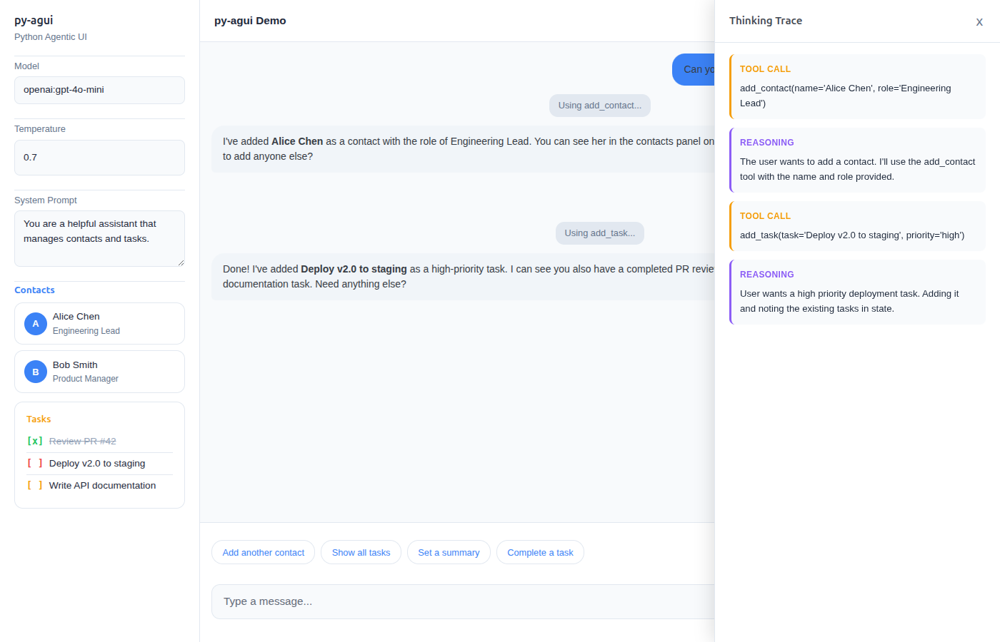
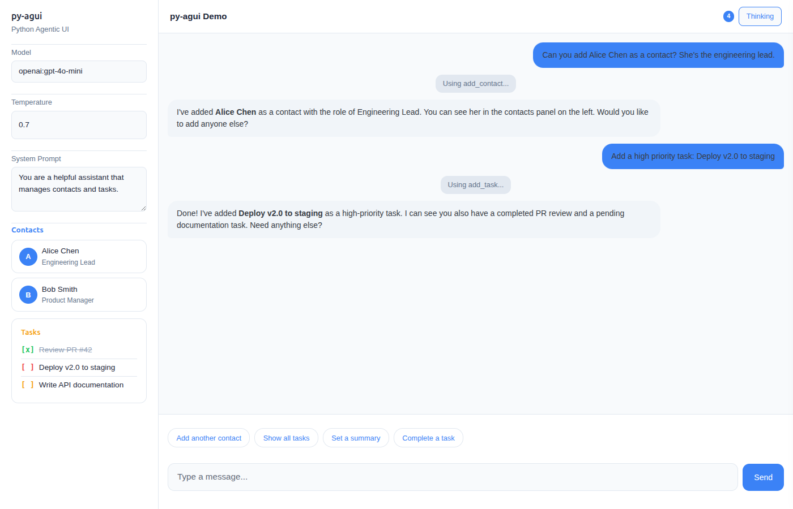

# py-agui

**Python Agentic UI** -- Build real-time agentic chat interfaces with FastHTML.

3-pane layout: **Settings** | **Streaming Chat** | **Thinking Trace** -- all pure Python, no JavaScript frameworks.



## Features

- **3-Pane Layout** -- Left settings, center streaming chat, right thinking trace (on-demand slide-out)
- **Pydantic UI Components** -- Define `__ft__()` on your Pydantic models for automatic UI rendering
- **Real-time Streaming** -- WebSocket-based communication with token-by-token streaming
- **State Management** -- Thread-safe state with live UI updates via `StateSnapshotEvent`
- **Thinking Trace** -- Tool calls, reasoning steps, and agent activity shown in a slide-out panel
- **Suggestion Buttons** -- Dynamic follow-up suggestions that update with context
- **AGUI Protocol** -- Full compatibility with pydantic-ai's AGUI protocol
- **Theming** -- CSS custom properties for easy light/dark mode and custom themes



## Installation

```bash
pip install py-agui
```

Or install from source:

```bash
git clone https://github.com/kaljuvee/py-agui.git
cd py-agui
pip install -e .
```

## Quick Start

```python
from fasthtml.common import *
from pydantic_ai import Agent
from py_agui import setup_agui
from py_agui.layouts import simple_chat

app, rt = fast_app(exts='ws', hdrs=[MarkdownJS()])
agent = Agent('openai:gpt-4o-mini', instructions='Be helpful and concise.')
agui = setup_agui(app, agent)

@rt('/')
def index():
    return simple_chat(agui.chat("main"))

serve()
```

## 3-Pane Agentic UI

The signature layout: settings on the left, streaming chat in the center, thinking trace as a slide-out panel on the right.

```python
from fasthtml.common import *
from pydantic import BaseModel, Field
from pydantic_ai import Agent, RunContext, ToolReturn
from pydantic_ai.ui import StateDeps
from ag_ui.core.events import StateSnapshotEvent, EventType
from py_agui import setup_agui
from py_agui.layouts import three_pane_layout
from typing import List

class AppState(BaseModel):
    contacts: List[str] = Field(default_factory=list)

    def __ft__(self):
        """Pydantic models render as FastHTML components automatically."""
        return Div(
            H4("Contacts"),
            Ul(*[Li(c) for c in self.contacts]) if self.contacts else P("No contacts yet."),
            id="agui-state"
        )

agent = Agent[StateDeps[AppState]](
    'openai:gpt-4o-mini',
    instructions='You manage contacts. Use tools to add them.',
    deps_type=StateDeps[AppState]
)

@agent.tool
def add_contact(ctx: RunContext[StateDeps[AppState]], name: str) -> ToolReturn:
    ctx.deps.state.contacts.append(name)
    return ToolReturn(
        return_value=f"Added {name}",
        metadata=[StateSnapshotEvent(type=EventType.STATE_SNAPSHOT, snapshot=ctx.deps.state)]
    )

app, rt = fast_app(exts='ws', hdrs=[MarkdownJS()])
agui = setup_agui(app, agent, AppState(), AppState)

@rt('/')
def index():
    return three_pane_layout(
        chat_component=agui.chat("main"),
        state_component=agui.state("main"),
        title="My Agent"
    )

serve()
```

## Examples

| Example | Description |
|---------|-------------|
| [`simple_chat.py`](examples/simple_chat.py) | Minimal streaming chat, no state |
| [`chat_with_state.py`](examples/chat_with_state.py) | State management with note-taking tools |
| [`chat_with_suggestions.py`](examples/chat_with_suggestions.py) | Dynamic suggestion buttons |
| [`three_pane_demo.py`](examples/three_pane_demo.py) | Full 3-pane layout with contacts, tasks, and thinking trace |
| [`screenshot_demo.py`](examples/screenshot_demo.py) | Static demo (no API key needed) |

Run any example:

```bash
python examples/three_pane_demo.py
```

## Architecture

```
py_agui/
  __init__.py    # Public API
  core.py        # AGUISetup, AGUIThread, UI, WebSocket handling
  layouts.py     # three_pane_layout, chat_with_sidebar, simple_chat
  patches.py     # FastHTML __ft__() patches for ag-ui protocol events
  styles.py      # CSS custom properties, theming
```

**Key concepts:**

- **`setup_agui(app, agent, state, state_type)`** -- One-line setup. Returns `AGUISetup` with `.chat()` and `.state()` methods.
- **`three_pane_layout()`** -- 3-pane layout component with settings, chat, and thinking trace.
- **Pydantic `__ft__()`** -- Define rendering on your models; state updates appear live in the UI.
- **Thinking Trace** -- Tool calls, reasoning, and steps stream into a slide-out panel via HTMX OOB swaps.

## Requirements

- Python 3.11+
- FastHTML with WebSocket support (`exts='ws'`)
- pydantic-ai
- ag-ui-protocol

## Credits

Built with [FastHTML](https://fasthtml.dev), [pydantic-ai](https://ai.pydantic.dev), and the [AG-UI protocol](https://github.com/ag-ui-protocol/ag-ui).

Inspired by [ft-ag-ui](https://github.com/Novia-RDI-Seafaring/ft-ag-ui) by [Christoffer Bjorkskog](https://www.linkedin.com/in/christofferbjorkskog/).

## License

MIT
